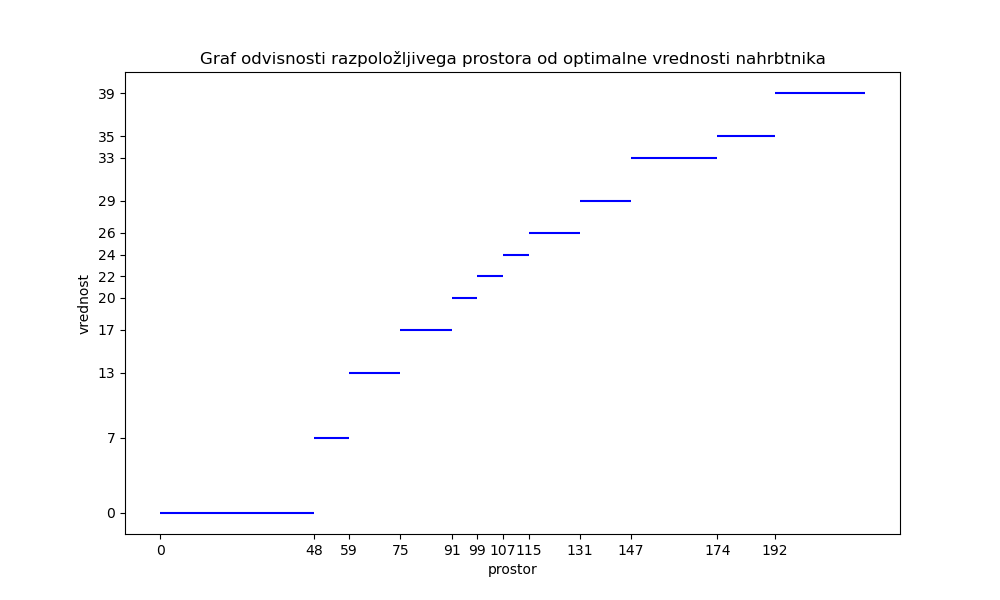

# Poročilo

**Ime:** Urša Kumelj

**Datum:** 5.1.2024

---

# Naloga 1
Izračun množic S in Z
Dani so predmeti:

|   i     |  1   |  2   |  3   |  4   |
|-------- |------|------|------|------|
| vrednost|  6   |  9   |  4   |  7   |
| velikost| 10   |  7   | 13   |  8   |

Izračunajte množico S4.

$S_{0}$ = [(0, 0)]

$Z_{1}$ = [(10, 6)] 
$S_{1}$ = [(0, 0), (10, 6)]

$Z_{2}$ = [(7, 9), (17, 15)] 
$S_{2}$ = [(0, 0), (7, 9), (17, 15)]

$Z_{3}$ = [(13, 4), (20, 13), (30, 19)] 
$S_{3}$ = [(0, 0), (7, 9), (17, 15), (30, 19)]

$Z_{4}$ = [(8, 7), (15, 16), (25, 22), (38, 26)] 
$S_{4}$ = [(0, 0), (7, 9), (15, 16), (25, 22), (38, 26)]

# Naloga 2
Uporaba množic S in Z
Dani so predmeti:

|   i     |  1   |  2   |  3   |  4   |  5   |  6   |  7   |  8   |
|-------- |------|------|------|------|------|------|------|------|
| vrednost|  6   |  9   |  4   |  7   |  6   |  7   |  5   |  9   |
| velikost| 11   | 40   | 16   | 32   | 45   | 48   |  9   | 44   |

Z algoritmi smo že izračunali naslednje množice:

$S_{0}$ = [(0, 0)]

$Z_{1}$ = [(11, 6)] 
$S_{1}$ = [(0, 0), (11, 6)]

$Z_{2}$ = [(40, 9), (51, 15)] 
$S_{2}$ = [(0, 0), (11, 6), (40, 9), (51, 15)]

$Z_{3}$ = [(16, 4), (27, 10), (56, 13), (67, 19)] 
$S_{3}$ = [(0, 0), (11, 6), (27, 10), (51, 15), (67, 19)]

$Z_{4}$ = [(32, 7), (43, 13), (59, 17), (83, 22), (99, 26)] 
$S_{4}$ = [(0, 0), (11, 6), (27, 10), (43, 13), (51, 15), (59, 17), 
      (67, 19), (83, 22), (99, 26)]

$Z_{5}$ = [(45, 6), (56, 12), <b>(72, 20)</b>, (88, 19), (96, 21), (104, 23), 
      (112, 25), (128, 28), (144, 32)] 
$S_{5}$ = [(0, 0), (11, 6), (27, 10), (43, 13), (51, 15), (59, 17), 
      (67, 19), (83, 22), (99, 26), (128, 28), (144, 32)]

$Z_{6}$ = [(48, 7), (59, 13), (75, 17), (91, 20), (99, 22), (107, 24),
      (115, 26), (131, 29), (147, 33), (176, 35), (192, 39)] 
$S_{6}$ = [(0, 0), (11, 6), (27, 10), (43, 13), (51, 15), (59, 17),
      (67, 19), (83, 22), (99, 26), (128, 28), (131, 29), (144, 32),
      (147, 33), (176, 35), (192, 39)]

$Z_{7}$ = [(9, 5), (20, 11), (36, 15), (52, 18), (60, 20), (68, 22),
      (76, 24), (92, 27), (108, 31), (137, 33), (140, 34), (153, 37),
      (156, 38), (185, 40), (201, 44)] 
$S_{7}$ = [(0, 0), (9, 5), (11, 6), (20, 11), (36, 15), (52, 18), (60, 20),
      (68, 22), (76, 24), (92, 27), (108, 31), (137, 33), (140, 34),
      (153, 37), (156, 38), (185, 40), (201, 44)]

$Z_{8}$ = [(44, 9), (53, 14), (55, 15), (64, 20), (80, 24), (96, 27), (104, 29),
      (112, 31), (120, 33), (136, 36), (152, 40), (181, 42), (184, 43),
      (197, 46), (200, 47), (229, 49), (245, 53)] 
$S_{8}$ = [(0, 0), (9, 5), (11, 6), (20, 11), (36, 15), (52, 18), (60, 20),
      (68, 22), (76, 24), (92, 27), (104, 29), (108, 31), (120, 33), (136, 36),
      (152, 40), (181, 42), (184, 43), (197, 46), (200, 47), (229, 49), (245, 53)]

## Odgovori na vprašanja

* <b>Pri prepisu množice Z5 je pri natanko enem paru prišlo do napake. Kateri par je napačen in kakšen bi moral biti? Ali lahko napako ugotovimo, ne da bi ponovno računali Z5?</b>  
Da dobimo množico $Z_{5}$ potrebujemo vsakemu paru v množici $S_{4}$ prišteti (45,6). Po tej operaciji bi morala naša množica izgledati  
$Z_{5}$ = [(45, 6), (56, 12), <b>(72, 16)</b>, (88, 19), (96, 21), (104, 23), (112, 25), (128, 28), (144, 32)] 
Torej vidimo, da bi moral biti par (72, 20) enak (72, 16). Napako bi lahko našli brez računanja, saj bi moral imeti naslednjik od (72, 20) večjo vrednost, ampak ima manjšo (naslednjik je (88, 19)).

* <b>Če imamo na voljo 160 enot prostora, kakšna je optimalna vrednost nahrbtnika?</b> 
Naša optimalna vrednost nahrbtnika bi bila 40, saj temu pogoju ustreza par (152, 40) iz množice $S_{8}$.

* <b>Koliko neizkoriščenega prostora nam ostane, če optimalno napolnimo nahrbtnik velikosti 110 s prvimi petimi predmeti. Kakšna je ta optimalna vrednost polnitve? Opiši vse možne načine, kako dosežemo to optimalno vrednost!</b> 
Torej temu pogoju bo sedaj ustrezal par (99, 26), kar nam da vedeti, da bo neizkoriščenega prostora potem 11 (110-99=11).  
    1. To optimalno vrednost dobimo, če vzamemo predmete 1, 2, 3 in 4. To dobimo tako, da našemu najdenemu paru (99, 26) odštevamo (velikost, vrednost) posameznega predmeta od zadaj naprej. Ko dobimo novo vrednost, pogledamo ali je ta v prejšnji množici $S$. V našem primeru, ko (99, 26) odštejemo 5. predmet (45,6) dobimo (54, 20), ki ga ni v $S_{4}$, zato ga ne vzamemo. Nadaljujemo na 4. predmet. (99, 26) odštejemo (32, 7) in dobimo (67, 19), ki pa je v $S_{3}$, zato 4. predmet vzamemo. Tej novi vrednosti (67, 19) odštejemo 3. predmet in dobimo (51, 15), ki je v $S_{2}$. Spet to pomeni, da 3. predmet vzmamemo. To nadaljujemo do konca in se izkaže, da vzamemo tudi 2. in 1. predmet. 
    2. Drugi način pa bi lahko bil ta, da če je odšteta vrednost predmeta od optimalne vrednosti zadnji element v množici Z, potem smo ta predmet vzeli. Torej (99, 26) odštejemo (45, 6) in dobimo (54, 20). Pogledamo ali je ta vrednost zadnja v $Z_{4}$, ker je ni pomeni, da je zadnja vrednost še vedno ta optimalna (99, 26). Potem odštejemo 4. predmet in dobimo (67, 19). Ta je zadnja v $Z_{3}$, zato ta predmet vzamemo. Ponovno odštejemo (67, 19) 3. predmet in dobimo (51, 15), ki je zadnji v $Z_{2}$. Predmet 3 vzamemo. To nadaljujemo do konca.

* <b>Skiciraj graf funkcije, ki pokaže, kako se v odvisnosti od razpoložljivega prostora spreminja optimalna vrednost nahrbtnika, če imamo na voljo prvih 6 predmetov in 6. predmet moramo dati v nahrbtnik.</b>

