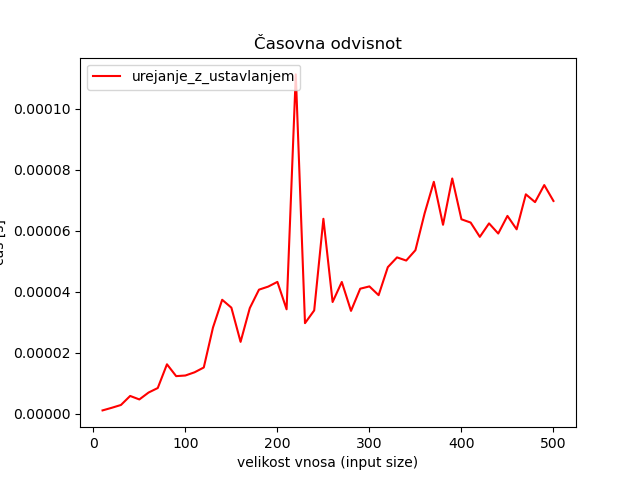
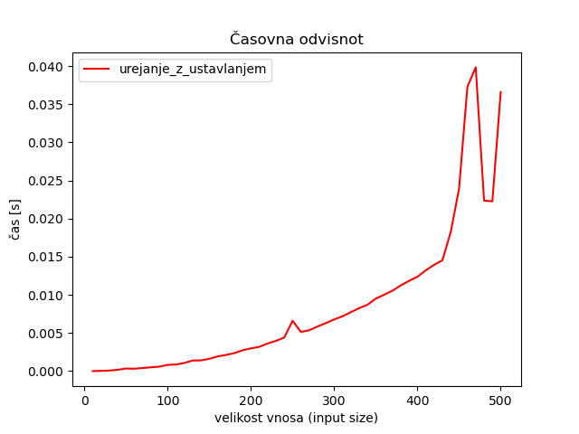
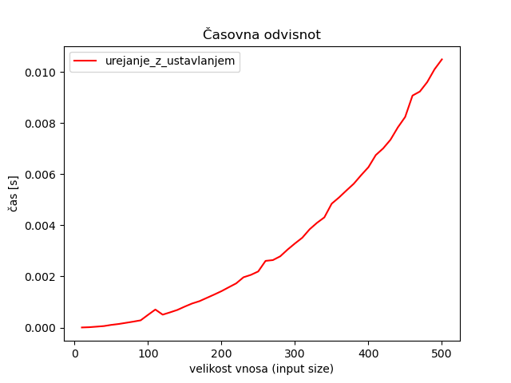
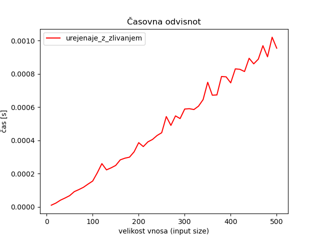
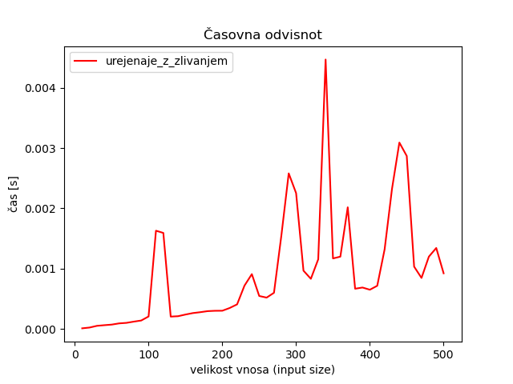
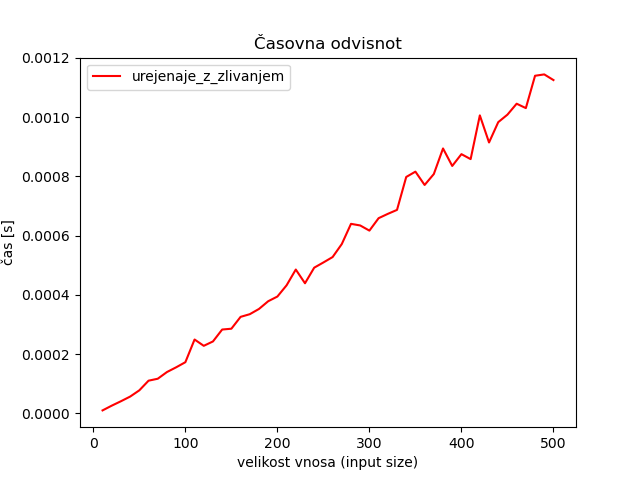
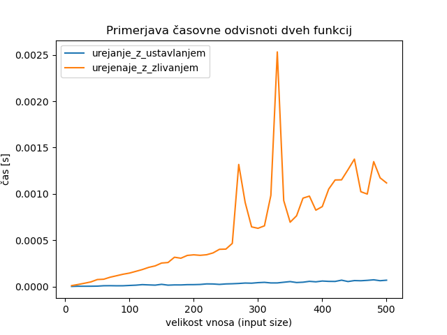
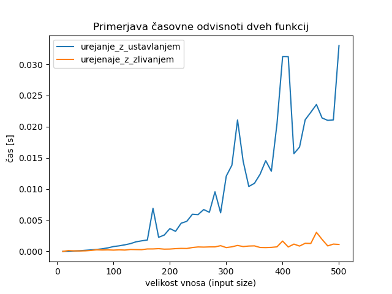
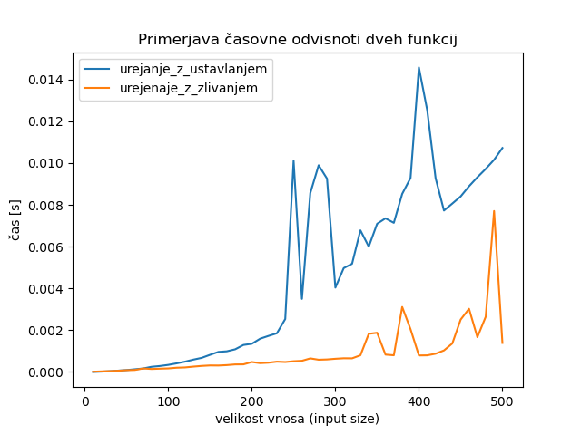

# Poročilo vaj Časovna odvisnost

**Ime:** Urša Kumelj

**Datum:** 24.11.2023

---

## Knjižnica merilnik
Knjižnica merilnik se mi zdi kar dobra. Jaz sem zaradi funkcije izvoz_podatkov spremenila funkcijo izmeri_cas, da mi vrača in ne izpisuje. Mislila sem, da bo ta moja funkcija izvoz_podatkov nekoliko bolj uporabna kot je sedaj. Bolj kot ne sem poskusila narediti izvoz podatkov (shranjevanje grafov, tabel v formatu po izbiri), vendar mi ni uspelo. Dodala sem tudi nekaj olepšav pri grafih, ki niso ravno pomembne, ampak vseeno priročne. Implementirala sem le funkcijo primerjava_dveh_grafov, ki oba grafa izriše v enem, zato da lahko lažje potem primerjam časovno odvisnost pri urejanje.py. Funkcijo izvoz_podatkov pa sem samo naredila, da mi meritve zapiše v datoteko.

## Urejanje

Implementirala sem:
* Urejanje z vstavljanjem 
* Urejanje z zlivanjem

Naredila sem 6 testov in sicer:
* seznam je bil že urejen npr. [1,2,3,4]
* seznam je bil urejen ravno v obratnem vrstnem redu npr. [4,3,2,1]
* seznam je bil naključno zgeneriran

### Urejanje z ustavljanjem 
1. urejen seznam
    
    Z razmislekom sem razbrala, da naj bi šlo za linearno časovno zahtevnost $O(n)$. Preko grafa to ni bilo razvidno, saj bi verjetno potrebovala imeti y koordinato veliko večjo. Videti je kot da je vse preveč približano. Ugotovitev pa sem potrdila z brskanjem po spletu.
     
    
2. seznam urejen v obratnem vrstnem redu

    To naj bi bil najslabši primer za časovno zahtevnost in sicer je enak $O(n^2)$. 

    

3. naključen seznam

    To sem izbrala za analizo naključne časovne zahtevnosti, ki je $O(n^2)$. Iz garfa bi rekla, da se to vidi.

    

### Urejanje z zlivanjem
1. urejen seznam
    
    Tukaj iz grafa ne znam razbrati, da gre za $O(n)$.

    

2. seznam urejen v obratnem vrstnem redu

    To naj bi bil najslabši primer za časovno zahtevnost in sicer je enak $O(nlog(n))$. To iz grafa ni najbolje razvidno.

    

3. naključen seznam

    Ta graf ni nič podoben grafu za najslabšo časovno zahtevnost, a se izkaše, da sta enaki. Torej $O(nlog(n))$.

    

### Primerjava obeh funkcij
1. urejen seznam
    
    Iz teh grafov je lažje ugotoviti za katero časovno odvisnot gre. 

    

2. seznam urejen v obratnem vrstnem redu
    
    Tudi tukaj je lažje razvidno kaj naj bi bila katera funkcija.

    

3. naključen seznam

    

Sicer pa bi iz grafov kar težko določili, da gre za O(n*logn).

---

Iz analize grafov sem videla, da je zares odvisno kakšen začetni seznam imamo. 

Algoritem z zlivanjem ima relativno nizko časovno zahtevnost ($O(nlog(n))$), a je njegova prostorska zahtevnost visoka ($O(n)$). To lahko oteži izvajanje pri delu z velikimi nabori podatkov ali v primerih, ko je shranjevanje v pomnilniku težava.

Algoritem z urejanjem zelo dobro deluje s skoraj razvrščenimi podatki. Prav tako je tudi stabilen. Dobro deluje z drugimi algoritmi za razvrščanje, da izboljša njihovo učinkovitost pri manjši količini podatkov. Negativna stran tega algoritma pa je kar velika časovna zahtevnost za povprečne podatke $O(n^2)$. Ker poleg vhodnega seznama uporabljamo samo stalno količino dodatnega pomnilnika, je prostorska zahtevnost $O(1)$.

Če sedaj primerjamo oba algoritma bi lahko zaključili s tem, da ima algoritem z zlivanjem boljšo časovno zahtevnost, algotirem z urejanjem pa boljšo prostorsko zahtevnost.

Koliko velik seznam še lahko uredimo v eni minuti? 
Gledala sem algoritem z urejanjem za naključno velik seznam. Stestirala sem za seznam velikosti n in dobila, da za to potrebuje 6s. Vem, da je časovna zahtevnosti $O(n)$, kar pomeni, da bo moja funkcija izgledala 
$$
T(n) = k * (n^2)
$$
$$
6 = k * (1000^2) \Rightarrow \frac{6}{k} = (1000^2)
$$
Vem pa, da iščem n: $$ 60 = k * n^2 \Rightarrow 10 = \frac{k}{6} * (n^2)$$
Od tod opazim, da lahko $\frac{6}{k}$ vstavim v zgornjo enačbo.
$$
10 = \frac{1}{1000^2} * n^2 \Rightarrow n = \sqrt{10 * 1000^2} \mathbf{\dot =} 3162
$$
Torej v eni minuti bi še lahko uredila naključni seznam velikosti 3162.

Menim, da se pri teh dveh algoritmih ne bi dalo nič izboljšati, lahko pa se motim.

# Viri
1. GeeksForGeeks, pridobljeno s [https://www.geeksforgeeks.org/merge-sort-vs-insertion-sort/] (https://www.geeksforgeeks.org/merge-sort-vs-insertion-sort/).
2. Interview Kickstart, pridobljeno s [https://www.interviewkickstart.com/learn/time-complexities-of-all-sorting-algorithms] (https://www.interviewkickstart.com/learn/time-complexities-of-all-sorting-algorithms).
3. Data Trained, pridobljeno s [https://datatrained.com/post/merge-sort-algorithm/] (https://datatrained.com/post/merge-sort-algorithm/).
4. GeeksForGeeks, pridobljeno s [https://www.geeksforgeeks.org/merge-sort/] (https://www.geeksforgeeks.org/merge-sort/).
5. Merge Sort, pridobljeno s [https://en.wikipedia.org/wiki/Merge_sort] (https://en.wikipedia.org/wiki/Merge_sort).
6. Insertion Sort, pridobljeno s [https://en.wikipedia.org/wiki/Insertion_sort] (https://en.wikipedia.org/wiki/Insertion_sort).

