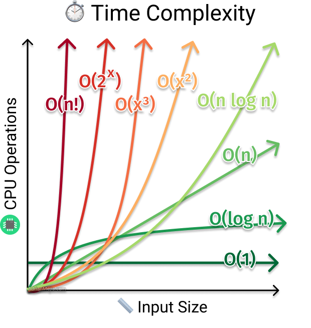

# Časovna zahtevnost
Vaje imajo dva sklopa. V prvem sklopu si bomo ogledali preprosto knjižnico za pomoč pri ocenjevanju in analizi časovne zahtevnosti algoritmov. V drugem delu bomo eksperimentirali z različnimi algoritmi za urejanje.

## Knjižnica za merjenje časa izvajanja

Najprej dopolnite funkcije `izmeri_cas`, `oceni_potreben_cas`, `narisi_in_pokazi_graf` in `izpisi_case`. Vse štiri funkcije kot argument sprejmejo funkcijo `fun`, katere čas izvajanja nas zanima. Vse funkcije, razen  funkcije `izmeri_cas` pa sprejmejo tudi generator primerov `gen_primerov`. Generator primerov je funkcija, ki ji podamo število `n`, in nam vrne primeren in relevanten vhod za `fun` velikosti `n`.

Funkcije imajo dokumentacijski komentar, v kodi pa so podani še dodatni namigi in komentarji za lažje dopolnjevanje funkcij.

Preverite pravilnost delovanja funkcij s pomočjo priloženih testnih funkcij `test_fun_lin`, `test_fun_kvad` z linearno in kvadratično časovno zahtevnostjo. Pri tem lahko uporabite generator naključnih seznamov dolžine `n`: `test_gen_sez`. Testno kodo "zapakirajte" v `if __name__ == "__main__"` ([več o tem](https://realpython.com/if-name-main-python/)).

Knjižnici dodajte še eno nadgradnjo:
* funkcije za primerjavo algoritmov (tabela z več stolpci ali graf, ki prikazuje več funkcij)
* izvoz podatkov (shranjevanje grafov, tabel v formatu po izbiri)
* dodatne testne funkcije z določeno časovno zahtevnostjo
* kakšna nadgradnja po lastni presoji, ki se vam zdi uporabna

## Algoritmi za urejanje
Ogledali si bomo štiri klasične algoritme za urejanje seznamov.
* Urejanje z mehurčki ([_bubble sort_](https://en.wikipedia.org/wiki/Bubble_sort))
* Urejanje z vstavljanjem ([_insertion sort_](https://en.wikipedia.org/wiki/Insertion_sort))
* Urejanje z zlivanjem ([_merge sort_](https://en.wikipedia.org/wiki/Merge_sort))
* Hitro urejanje ([_quick sort_](https://en.wikipedia.org/wiki/Quicksort))

Ustvarite novo datoteko `urejanje.py`. V njej implementirajte vsaj enega izmed prvih dveh in vsaj enega izmed zadnjih dveh algoritmov. Pravilnost delovanja funkcij ustrezno testirajte.  

Ko ste se prepričali o pravilnosti implementacije, uporabite knjižnico `merilnik`. Eksperimentirajte z različnimi velikostmi seznamov. Razmislite:
* Bi znali s pomočjo grafa ali tabele oceniti časovno zahtevnost? Se ta ujema s pričakovanji?
* Kako veliko tabelo naključnih števil še lahko uredimo v eni minuti?
* Ali algoritem v kakšnem primeru deluje veliko hitreje oziroma počasneje od povprečja? (urejeni seznami, izbira pivota pri hitrem urejanju, ...)
* Kakšne so prednosti in kakšne slabosti algoritma?
* Bi znali oceniti prostorsko zahtevnost? (Koliko prostora porabi algoritem _poleg_ prostora za vhodne in izhodne podatke)
* Bi se dalo kaj izboljšati?
* Primerjajte različne algoritme na različno velikih problemih. Kaj ugotovite?

Tistim, ki ste prisotni na vajah, priporočam delo v parih. Vsak iz para lahko na primer implementira dva izmed algoritmov, nato pa si implementacije izmenjata (obvezno označite, katere funkcije so vaše lastno delo), lahko pa skupaj implementirata vse izmed algoritmov. Skupaj lahko načrtujeta različne eksperimente in diskutirata o ugotovitvah. Na koncu vaj bi nekaj minut namenili deljenju ugotovitev.

## Poročilo

Za uspešno opravljene vaje oddajte izpolnjeni datoteki `merilnik.py` in `urejanje.py`. Prav tako napišite Markdown poročilo (datoteko s končnico .md kot je tale), ki vsebuje:

1. Opažanja glede knjižnice `merilnik` (komentarji, zanimivi primeri, pomanjkljivosti orodja, možne izboljšave - katero izmed njih ste implementirali?).

2. Ugotovitve glede algoritmov za urejanje. Lahko v obliki odgovorov na zgornja vprašanja. Dodajte predstavitev rezultatov (tabele, grafi)...

Pri pisanju poročila si pomagajte z datotekama `Primer poročila v markdown formatu` ter `Predloga Markdown poročila`. Struktura bo sicer tule nekoliko drugačna, a vam lepo prikaže najpogostejše ukaze.

Če ste si pomagali z zunanjimi viri, jih obvezno navedite.

Vgrajevanje slike v Markdown:
